# HackDigest Architecture

## 1. Architecture Overview

```
┌─────────────────────────────────────────────────────────────────────────┐
│                         GitHub Actions (CI/CD)                          │
│                                                                         │
│  ┌─────────────┐   ┌──────────────┐   ┌────────────┐   ┌────────────┐ │
│  │  Fetchers    │──▶│  Summarizer  │──▶│   Cache    │──▶│  Notifier  │ │
│  │ (HN/RSS)    │   │  (Groq LLM)  │   │  (JSON)    │   │(Gmail SMTP)│ │
│  └─────────────┘   └──────────────┘   └────────────┘   └────────────┘ │
│        │                   │                                     │      │
│  ┌─────┴─────┐    ┌───────┴───────┐                       ┌─────┴────┐ │
│  │ HN API    │    │ Groq API      │                       │ Gmail    │ │
│  │ Yahoo RSS │    │ qwen3.8-27b   │                       │ SMTP_SSL │ │
│  │ Google RSS│    │ Google Trans.  │                       │ port 465 │ │
│  └───────────┘    └───────────────┘                       └──────────┘ │
└─────────────────────────────────────────────────────────────────────────┘

┌─────────────────────────────────────────────────────────────────────────┐
│                      Subscription System                                │
│                                                                         │
│  ┌──────────┐    ┌──────────────────┐    ┌─────────────┐    ┌────────┐ │
│  │  GitHub   │───▶│  Cloudflare     │───▶│  GitHub     │───▶│ subs.  │ │
│  │  Pages    │    │  Worker (proxy) │    │ repo_dispatch│   │  .yml  │ │
│  │ (Web UI) │    │  (rate limited) │    │  event       │   │workflow│ │
│  └──────────┘    └──────────────────┘    └─────────────┘    └────────┘ │
└─────────────────────────────────────────────────────────────────────────┘
```

### Mermaid Diagram

```mermaid
flowchart TD
    subgraph "Daily Digest Pipeline"
        A[GitHub Actions Cron] --> B[Fetch Articles]
        B --> B1[HN API - Tech]
        B --> B2[Yahoo RSS / Google News - Stocks]
        B --> B3[Zillow·HousingWire·CNBC / Google News - Real Estate]
        B1 --> C[Summarize via Groq LLM]
        B2 --> C
        B3 --> C
        C --> D{Cache Hit?}
        D -- Yes --> F[Load from Cache]
        D -- No --> E[Generate Summary]
        E --> G[Save to Cache]
        F --> H[Send Email via Gmail SMTP]
        G --> H
        H --> I[Subscribers' Inboxes]
    end

    subgraph "Subscription Flow"
        J[GitHub Pages Web UI] --> K[Cloudflare Worker Proxy]
        K --> L[GitHub repository_dispatch]
        L --> M[subscribers.yml Workflow]
        M --> N[Update subscribers.json]
        N --> O[Send Welcome/Goodbye Email]
    end

    subgraph "Deploy Pipeline"
        P[Push to main] --> Q[Clear All Caches]
        Q --> R[Run Test Digest]
    end
```



---

## 2. Tech Stack

| Component | Technology | Details |
|---|---|---|
| **LLM** | Groq API | Model: `qwen/qwen3.8-27b`, temperature 0.3, max 400 tokens, 3-sentence summaries |
| **RSS Parsing** | feedparser | Parses Yahoo Finance, Google News Korea, Zillow, HousingWire, CNBC feeds |
| **Content Extraction** | trafilatura | Extracts article body text from URLs; fallback to LLM knowledge if extraction fails |
| **Translation Fallback** | Google Translate (free API) | `translate.googleapis.com/translate_a/single` — used when Groq output isn't sufficiently Korean |
| **Email Delivery** | Gmail SMTP (SMTP_SSL) | Primary: `SMTP_SSL` on port 465; Fallback: `STARTTLS` on port 587; single connection reused for all recipients |
| **Subscription Proxy** | Cloudflare Worker | Keeps GitHub PAT server-side; proxies subscribe/unsubscribe requests to GitHub API |
| **CI/CD** | GitHub Actions | 3 workflows: `daily-digest.yml`, `subscribers.yml`, `clear-cache.yml` |
| **Caching** | GitHub Actions Cache | `actions/cache@v4` with `data/cache` directory; date-keyed JSON files |
| **Frontend** | GitHub Pages | Static HTML + vanilla JS, dark theme, i18n (ko/en), hosted at `minjungsung.github.io/hackdigest` |
| **Language** | Python 3.11 | Main application; dependencies managed via `requirements.txt` |
| **Data Models** | Python dataclasses + Enum | `Article`, `Subscriber`, `Topic` (tech/stocks/realestate), `Language` (ko/en) |

---

## 3. Data Flow

### Daily Digest Pipeline

```
1. LOAD SUBSCRIBERS
   subscribers.json → list[Subscriber] (email, language, topics)
   Test mode: override with EMAIL_TEST_TO env var

2. DETERMINE (TOPIC, LANGUAGE) COMBOS
   For each subscriber's topics × language
   Language-dependent topics (stocks, realestate): separate fetch per language
   Language-independent topics (tech): fetch once, share across languages

3. FETCH ARTICLES
   For each (topic, language) combo:
   ├── Check article cache (data/cache/articles_YYYY-MM-DD_TOPIC.json)
   ├── If cached → use cached articles
   └── If not → fetch from source API/RSS
       ├── Tech: HN API /topstories → fetch top 50 → filter non-tech → sort by score → top 5
       ├── Stocks (en): Yahoo Finance RSS → keyword filter → impact score → top 5
       ├── Stocks (ko): Google News Korea RSS (주식+코스피) → keyword filter → top 5
       ├── Real Estate (en): Zillow + HousingWire + CNBC RSS → keyword filter → top 5
       └── Real Estate (ko): Google News Korea RSS (부동산+아파트) → keyword filter → top 5

4. SUMMARIZE
   For each (topic, language) combo with articles:
   ├── Check summary cache (data/cache/summaries_YYYY-MM-DD_LANG.json)
   ├── Skip already-summarized articles
   └── For uncached articles:
       ├── Translate title to target language (Groq LLM)
       ├── Extract body text (trafilatura)
       ├── If extraction fails → use LLM knowledge (title-based explanation)
       ├── Summarize body in 3 sentences (Groq API, qwen/qwen3.8-27b)
       ├── Verify language correctness (_is_mostly_korean)
       ├── If not target language → force translate (Groq → Google Translate fallback)
       └── Save all summaries to cache (merge with existing)

5. SAVE ARTICLE CACHE
   Save articles once per topic (deduped)

6. SEND EMAILS
   Open single SMTP_SSL connection
   For each subscriber × topic:
   ├── Build mobile-friendly HTML email
   ├── Include: numbered articles, scores, comments, discussion links
   ├── Include: unsubscribe link
   └── Send via shared SMTP connection
```

---

## 4. Topic Sources

### Tech

| Attribute | Value |
|---|---|
| Source | Hacker News Firebase API (`hacker-news.firebaseio.com/v0`) |
| Endpoint | `/topstories.json` → individual `/item/{id}.json` |
| Selection | Fetch top 50 stories, filter non-tech (politics, sports, celebrities), sort by score descending, take top 5 |
| Language behavior | Language-independent — same articles for all languages, summaries translated per language |
| Data fields | title, url, hn_url, score, comment_count |

**Non-tech filter patterns:** politics, election, sports (NFL/NBA/MLB/FIFA), celebrity, recipe, horoscope, etc.

### Stocks

| Attribute | English (en) | Korean (ko) |
|---|---|---|
| Source | Yahoo Finance RSS | Google News Korea RSS |
| Feed URLs | `finance.yahoo.com/news/rssurl` | `news.google.com/rss/search?q=주식+코스피+코스닥` and `q=증시+주가+상장` |
| Keyword filter | stock, market, S&P, NASDAQ, earnings, Fed, crypto, etc. | 주식, 코스피, 코스닥, 증시, 주가, ETF, etc. |
| Impact keywords | surge, crash, record, Tesla, Apple, NVIDIA, etc. | 급등, 급락, 폭등, 삼성, SK, 네이버, etc. |
| Ranking | Impact keyword score + multi-source appearance bonus | Same algorithm |
| Deduplication | Normalize title (strip source suffix), group by similarity | Same |

### Real Estate

| Attribute | English (en) | Korean (ko) |
|---|---|---|
| Sources | Zillow Research RSS, HousingWire RSS, CNBC Real Estate RSS | Google News Korea RSS |
| Feed URLs | `zillow.com/research/feed/`, `housingwire.com/feed/`, `search.cnbc.com/...?id=10000115` | `news.google.com/rss/search?q=부동산+아파트+매매` and `q=부동산+전세+분양` |
| Keyword filter | housing, mortgage, real estate, rent, foreclosure, etc. | 부동산, 아파트, 매매, 전세, 분양, 청약, etc. |
| Impact keywords | surge, crash, bubble, forecast, etc. | 급등, 급락, 서울, 강남, 수억, etc. |
| Ranking | Impact keyword score + multi-source appearance bonus | Same algorithm |

---

## 5. Language System

HackDigest supports two languages: **Korean (ko)** and **English (en)**. Language affects multiple layers:

### Per-Layer Language Behavior

| Layer | Behavior |
|---|---|
| **Article Fetching** | Language-dependent topics (stocks, realestate) fetch from different sources per language. Language-independent topics (tech) fetch the same articles regardless of language. |
| **Title Translation** | English titles are translated to Korean via Groq LLM. English subscribers keep original titles. |
| **Summarization** | Separate system prompts per language. Korean prompt enforces casual tone (했어요, 인 셈이죠). English prompt uses casual friendly tone. |
| **Language Verification** | Korean summaries are verified with `_is_mostly_korean()` (≥40% Korean characters). If verification fails, text is force-translated via Groq → Google Translate fallback chain. |
| **Caching** | Summaries are cached per language: `summaries_YYYY-MM-DD_ko.json` and `summaries_YYYY-MM-DD_en.json`. Articles are cached per topic (shared across languages for language-independent topics). |
| **Email UI** | Email subject, header text, stats labels, footer text, and unsubscribe link text are localized per subscriber language. |
| **Web UI** | The subscription page (`docs/index.html`) supports ko/en toggle with full i18n. Language is auto-detected from browser locale/timezone and sent to the backend as the subscriber's digest language. |

### Topic ↔ Language Matrix

| Topic | `LANGUAGE_DEPENDENT_TOPICS` | EN Source | KO Source |
|---|---|---|---|
| Tech | No | HN API | HN API (same) |
| Stocks | Yes | Yahoo Finance RSS | Google News Korea |
| Real Estate | Yes | Zillow + HousingWire + CNBC | Google News Korea |

---

## 6. Caching Strategy

### Cache Location

All cache files are stored in `data/cache/` and persisted across workflow runs via `actions/cache@v4`.

### File Naming Convention

| Type | Pattern | Example |
|---|---|---|
| Articles | `articles_YYYY-MM-DD_TOPIC.json` | `articles_2025-07-15_tech.json` |
| Summaries | `summaries_YYYY-MM-DD_LANG.json` | `summaries_2025-07-15_ko.json` |

- Date is always **KST (UTC+9)**.
- Articles are keyed by topic (shared across languages for language-independent topics).
- Summaries are keyed by language (shared across topics — merged on save to avoid overwrites).

### Cache Key Strategy

```yaml
key: hackdigest-v2-${{ github.run_id }}
restore-keys: |
  hackdigest-v2-
```

- Each run creates a new cache entry keyed by `run_id`.
- Restore falls back to the most recent `hackdigest-v2-` prefix match.
- This ensures daily cache accumulation while allowing fresh data daily (date-keyed filenames).

### Cache Lifecycle

| Event | Behavior |
|---|---|
| **Daily run** | Restores latest cache → checks for today's files → fetches only if missing → saves new cache |
| **Summary generation** | Loads existing summary cache → summarizes only uncached URLs → merges and saves |
| **Deploy (push to main)** | `clear-cache.yml` deletes ALL caches via `gh cache delete` → runs test digest with fresh data |
| **Subscriber welcome** | Restores cache → uses cached articles if available → fetches fresh if not → summarizes in subscriber's language |

### Summary Cache Merging

When saving summaries, the system loads the existing file first and merges new entries:

```python
existing = load existing summaries file
new_data = {url: {title, summary, language} for each summarized article}
existing.update(new_data)  # new entries overwrite same URLs
save merged dict
```

This prevents different topics from overwriting each other's summaries in the same language file.

---

## 7. Subscription Flow

### End-to-End Flow

```
User (Browser)                Cloudflare Worker              GitHub                    Repository
     │                              │                           │                          │
     │  1. Fill form on             │                           │                          │
     │     GitHub Pages             │                           │                          │
     │                              │                           │                          │
     │  2. POST {action, email,     │                           │                          │
     │     language, topics}        │                           │                          │
     │ ────────────────────────────▶│                           │                          │
     │                              │                           │                          │
     │                              │  3. Rate limit check      │                          │
     │                              │     (IP-based)            │                          │
     │                              │                           │                          │
     │                              │  4. POST /repos/.../      │                          │
     │                              │     dispatches             │                          │
     │                              │  ────────────────────────▶│                          │
     │                              │                           │                          │
     │  5. 200 OK                   │  6. 204 No Content        │                          │
     │ ◀────────────────────────────│◀─────────────────────────│                          │
     │                              │                           │                          │
     │  (Show success page)         │                           │  7. Trigger              │
     │                              │                           │     subscribers.yml      │
     │                              │                           │ ────────────────────────▶│
     │                              │                           │                          │
     │                              │                           │  8. Validate email       │
     │                              │                           │  9. Add/remove/update    │
     │                              │                           │     subscribers.json     │
     │                              │                           │  10. git commit + push   │
     │                              │                           │  11. Send welcome/       │
     │                              │                           │      goodbye email       │
```

### Components

**GitHub Pages (Frontend)**
- Hosted at `https://minjungsung.github.io/hackdigest/`
- Static HTML + vanilla JS with dark theme
- Full i18n support (ko/en) with auto-detection (browser locale, timezone)
- Subscribe tab: email + topic selection (Tech, Stocks, Real Estate)
- Unsubscribe tab: email only
- Supports URL params: `?action=unsubscribe&email=...` (linked from email footer)

**Cloudflare Worker (Proxy)**
- Endpoint: `https://hackdigest-proxy.hackdigest.workers.dev`
- Keeps `GITHUB_TOKEN` (fine-grained PAT) server-side — never exposed to browser
- Validates: required fields, action enum (`add`/`remove`/`update`), email format
- CORS: allows `minjungsung.github.io`, `localhost:3000`, `127.0.0.1:3000`, `null` (file://)
- Forwards to GitHub `repository_dispatch` API with event type `manage_subscriber`

**GitHub Actions (`subscribers.yml`)**
- Triggered by `repository_dispatch` (web) or `workflow_dispatch` (manual)
- Resolves parameters from either source
- Validates email format
- Executes Python subscriber management (`add_subscriber`, `remove_subscriber`, `update_subscriber`)
- Commits `subscribers.json` changes via `github-actions[bot]`
- On add: sends welcome email with today's cached articles (fetches fresh if no cache)
- On remove: sends goodbye email with resubscribe link

---

## 8. Rate Limiting

### Groq API (429 Retry)

The Groq LLM API enforces rate limits. The summarizer implements exponential backoff:

```
Retry strategy:
  Max retries: 3
  Base delay: 5 seconds
  Delay formula: 5 * (attempt + 1) seconds
  → Attempt 1: wait 5s
  → Attempt 2: wait 10s
  → Attempt 3: give up, return empty string

On failure: article gets fallback summary or placeholder text
```

| Parameter | Value |
|---|---|
| `GROQ_MAX_RETRIES` | 3 |
| `GROQ_RETRY_BASE_DELAY` | 5 seconds |
| Request timeout | 20 seconds |
| Temperature | 0.3 |
| Max tokens | 400 (summary), 100 (title translation) |
| Input truncation | 1500 chars (Korean), 3000 chars (English) |

### Cloudflare Worker (IP Rate Limit)

The subscription proxy enforces in-memory per-IP rate limits:

| Limit | Window | Max Requests |
|---|---|---|
| Per-minute | 60 seconds | 5 requests |
| Per-hour | 3600 seconds | 20 requests |

Implementation details:
- In-memory `Map<IP, timestamp[]>` — resets when worker instance recycles
- Old entries cleaned on each request (no `setInterval` in Workers)
- Returns HTTP 429 with descriptive message when limited
- Uses `CF-Connecting-IP` header for client identification

### HN API (Retry)

The tech fetcher includes retry logic for HN API calls:

| Parameter | Value |
|---|---|
| Max retries | 3 (list endpoints), 1 (individual items) |
| Retry delay | 1 second between attempts |
| Request timeout | 10 seconds |
| Prefetch count | 50 stories (to have room after filtering) |

---

## Appendix: File Structure

```
hackdigest/
├── src/
│   ├── main.py              # Entry point: orchestrates fetch → summarize → cache → email
│   ├── models.py            # Data models: Article, Subscriber, Topic, Language
│   ├── summarizer.py        # Groq LLM summarization + translation + language verification
│   ├── notifier.py          # Gmail SMTP email sending (HTML templates, welcome/goodbye)
│   ├── cache.py             # JSON file cache (articles + summaries, date-keyed)
│   ├── subscribers.py       # Subscriber CRUD (load/save/add/remove/update from JSON)
│   └── fetchers/
│       ├── __init__.py      # Topic dispatcher + LANGUAGE_DEPENDENT_TOPICS set
│       ├── tech.py          # HN API fetcher (top stories, score-sorted, non-tech filter)
│       ├── stocks.py        # Yahoo Finance RSS (en) / Google News Korea (ko)
│       └── realestate.py    # Zillow+HousingWire+CNBC (en) / Google News Korea (ko)
├── worker/
│   └── src/
│       └── index.js         # Cloudflare Worker: subscription proxy with rate limiting
├── docs/
│   └── index.html           # GitHub Pages: subscription web UI (dark theme, i18n)
├── .github/workflows/
│   ├── daily-digest.yml     # Daily digest pipeline (security scan → fetch → summarize → email)
│   ├── subscribers.yml      # Subscriber management (add/remove/update → commit → welcome email)
│   └── clear-cache.yml      # Deploy pipeline (clear all caches → run test digest)
├── subscribers.json          # Subscriber database (email, language, topics)
├── data/cache/               # Runtime cache directory (gitignored, persisted via Actions Cache)
└── requirements.txt          # Python dependencies
```
